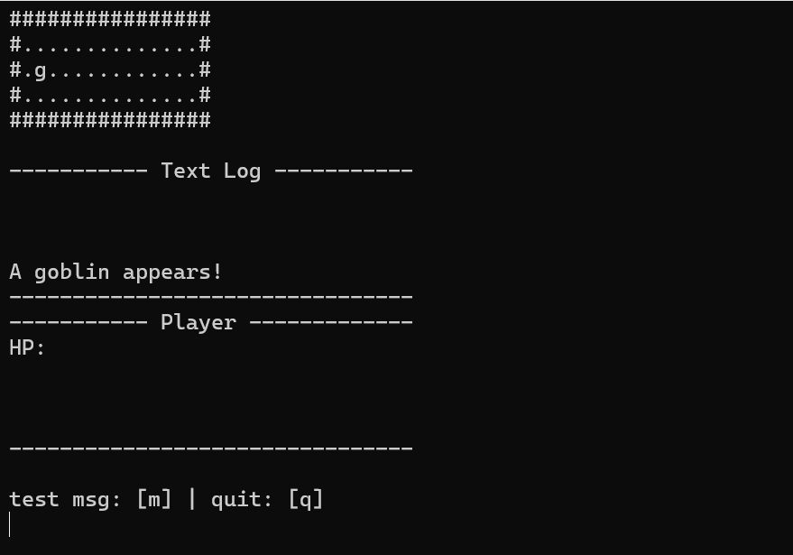

# Dungeon Crawl

Let's try to make an ASCII rendered dungeon crawler game!

Here is a preview of what the starter code gets you.



## Initial Setup

1. Clone down this repo.

2. Open a terminal and run the CMake generate command for the OS you are developing on.

```
# Windows
cmake -B _build
```

```
# Linux
cmake -B _build -DCMAKE_BUILD_TYPE=Debug
```

3. There are several ways to edit, build, and run the code. On Windows, it is probably easiest to use the Visual Studio project `_build/DungeonCrawl.sln`. On Linux, you can use the commands below to build, install, and debug the executable.

```
# Windows

start _build/DungeonCrawl.sln
```

```
# Linux

## Build
cmake --build _build --parallel $(nproc)

## Install
cmake --install _build --prefix _install

## Debug
gdb -tui _install/bin/DungeonCrawl
```

## The Goal List

**MVP Goals**

- [-] A playable dungeon by the end of the day

    - [-] Dungeon engine

        - [-] Update loop

            - [-] Player input

            - [-] ASCII rendering

    - [-] Rooms

        - [ ] Room API

        - [+] Room interface

        - [ ] Dynamic loading at runtime (.dll or .so)

            - [ ] Debuggable in VS from the install directory

- [ ] Experiment with C++ concepts discussed ealier

    - [ ] Rule of 0, 3, 5

    - [ ] Smart pointers

        - [ ] std::move

    - [ ] Unit tests 

**Stretch Goals**

- [ ] Colored rendering using ANSI escape sequences.

